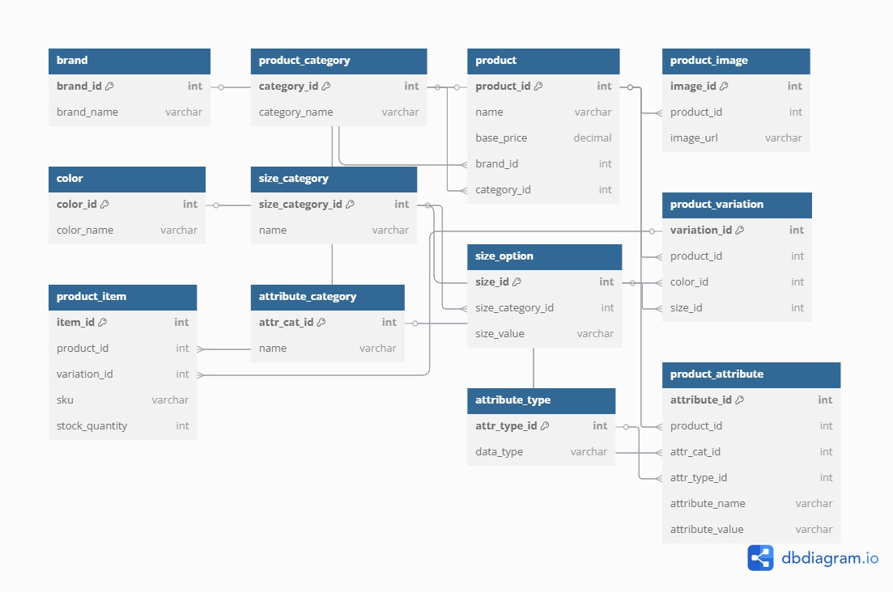

# 🛒 **E-commerce Database Design**

---

## 📋 *Project Overview*

This project is a **collaborative peer group assignment** to design and implement a *relational database* for an e-commerce platform. The goal is to create an **Entity-Relationship Diagram (ERD)** and a corresponding `SQL` schema to manage *products*, *categories*, *brands*, *variations*, *attributes*, and *images*. The database is **scalable**, **normalized**, and **efficient**, supporting core e-commerce functionalities like:

- **Product browsing**
- **Variation selection**
- **Inventory management**

### 🎯 *Key Deliverables*

- **ERD**: A visual representation of entities, attributes, and relationships (`ERD.png`).
- **SQL Schema**: A script defining all tables with constraints (`ecommerce.sql`).
- **Documentation**: This `README.md` explaining the *project structure*, *setup*, and *usage*.


---

## 🗺️ *Entity-Relationship Diagram (ERD)*

The ERD is available as `ERD.png`, created using **dbdiagram.io**. It illustrates the *database structure*, including **entities**, **attributes**, and **relationships**.

### 📑 *Entities and Attributes*

| **Table**              | **Purpose**                              | **Attributes**                                                                 |
|-------------------------|------------------------------------------|--------------------------------------------------------------------------------|
| `product_image`        | Stores image URLs for product items      | `image_id` (PK), `product_item_id` (FK), `image_url`, `alt_text`              |
| `color`                | Manages color options                    | `color_id` (PK), `color_name` (unique), `hex_code`                            |
| `product_category`     | Classifies products into categories      | `category_id` (PK), `category_name` (unique), `parent_category_id` (FK)       |
| `product`              | Stores general product details           | `product_id` (PK), `category_id` (FK), `brand_id` (FK), `product_name`, `base_price`, `description` |
| `product_item`         | Represents purchasable items             | `item_id` (PK), `product_id` (FK), `sku` (unique), `price`, `stock_quantity`  |
| `brand`                | Stores brand information                 | `brand_id` (PK), `brand_name` (unique), `brand_description`                   |
| `product_variation`    | Links items to size/color variations     | `variation_id` (PK), `item_id` (FK), `size_option_id` (FK), `color_id` (FK)   |
| `size_category`        | Groups sizes (e.g., clothing, shoes)     | `size_category_id` (PK), `category_name` (unique)                             |
| `size_option`          | Lists specific sizes (e.g., S, M, L)     | `size_option_id` (PK), `size_category_id` (FK), `size_name` (unique per category) |
| `product_attribute`    | Stores custom attributes (e.g., material)| `attribute_id` (PK), `product_id` (FK), `attribute_category_id` (FK), `attribute_type_id` (FK), `attribute_value` |
| `attribute_category`   | Groups attributes (e.g., physical)       | `attribute_category_id` (PK), `category_name` (unique)                        |
| `attribute_type`       | Defines attribute types (e.g., text)     | `attribute_type_id` (PK), `type_name` (unique)                               |

### 🔗 *Relationships*

- **One-to-Many**:
  - `product_category` → `product`: *One category* has **many products**.
  - `brand` → `product`: *One brand* has **many products**.
  - `product` → `product_item`: *One product* has **many items**.
  - `product_item` → `product_image`: *One item* has **many images**.
  - `size_category` → `size_option`: *One size category* has **many sizes**.
  - `product` → `product_attribute`: *One product* has **many attributes**.
  - `attribute_category` → `product_attribute`: *One attribute category* has **many attributes**.
  - `attribute_type` → `product_attribute`: *One attribute type* applies to **many attributes**.
- **Many-to-Many** (via `product_variation`):
  - `product_item` ↔ `size_option`: *Items* can have **multiple sizes**.
  - `product_item` ↔ `color`: *Items* can have **multiple colors**.
- **Self-Referential**:
  - `product_category` → `product_category`: Supports *subcategories*.

### 🖼️ *ERD Visualization*

The `ERD.png` file shows:
- **Tables** with *primary keys* (PK) and *foreign keys* (FK).
- **Relationships** with *cardinality* (e.g., `1:N`, `N:N`).
- **Constraints** like *uniqueness* and `NOT NULL`.



---

## 🔄 *Data Flow*

The database supports **key e-commerce operations**:

1. **Browsing**: 🛍️ *Customers* browse products by `product_category` → `product`.
2. **Product Details**: 📋 View *product details*, `product_attribute`, and `product_image`.
3. **Variations**: 🎨 Select *specific variations* (e.g., size, color) via `product_item` and `product_variation`.
4. **Inventory**: 📦 Check *stock availability* (`product_item.stock_quantity`).
5. **Customization**: 🛠️ *Attributes* provide flexible product details (e.g., `material`, `weight`).

The schema is **normalized** (*3NF*) to minimize redundancy and uses **foreign keys** for *referential integrity*. *Indexes* on foreign keys ensure **efficient queries**.

---

## 📂 *Repository Structure*

```
ecommerce-database/
├── ERD.png          # 🖼️ Entity-Relationship Diagram
├── ecommerce.sql    # 💻 SQL schema for table creation
├── README.md       # 📝 Project documentation
```

---

## 🛠️ *Setup Instructions*

Follow these steps to **set up** and **test** the database:

### *Prerequisites*

- Install **MySQL** or **MySQL Workbench**.
- Ensure you have *permissions* to create databases.

### *Steps*

1. **Clone the repository**:
   ```bash
   git clone https://github.com/your-group/ecommerce-database.git
   ```
2. **Open MySQL Workbench** or a *MySQL client*.
3. **Run the SQL script**:
   ```bash
   mysql -u your_username -p < ecommerce.sql
   ```
4. **Enter your MySQL password** when prompted.
5. **Verify the database** and *tables*:
   ```sql
   USE ecommerce;
   SHOW TABLES;
   ```

### *Testing*

- Insert **sample data** (see below).
- Run **sample queries** to validate *relationships*.

#### *Sample Data*

```sql
-- Insert a category
INSERT INTO product_category (category_name) VALUES ('Clothing');

-- Insert a brand
INSERT INTO brand (brand_name) VALUES ('Nike');

-- Insert a product
INSERT INTO product (category_id, brand_id, product_name, base_price)
VALUES (1, 1, 'T-shirt', 29.99);

-- Insert a color
INSERT INTO color (color_name, hex_code) VALUES ('Blue', '#0000FF');

-- Insert a size category and option
INSERT INTO size_category (category_name) VALUES ('Clothing Sizes');
INSERT INTO size_option (size_category_id, size_name) VALUES (1, 'M');

-- Insert a product item
INSERT INTO product_item (product_id, sku, price, stock_quantity)
VALUES (1, 'TSHIRT-BLUE-M', 29.99, 100);

-- Insert a product variation
INSERT INTO product_variation (item_id, size_option_id, color_id)
VALUES (1, 1, 1);

-- Insert an image
INSERT INTO product_image (product_item_id, image_url, alt_text)
VALUES (1, 'https://example.com/tshirt-blue-m.jpg', 'Blue T-shirt');

-- Insert an attribute
INSERT INTO attribute_category (category_name) VALUES ('Physical');
INSERT INTO attribute_type (type_name) VALUES ('Text');
INSERT INTO product_attribute (product_id, attribute_category_id, attribute_type_id, attribute_value)
VALUES (1, 1, 1, 'Cotton');
```

#### *Sample Queries*

1. **Fetch product details with variations**:
   ```sql
   SELECT p.product_name, pi.sku, c.color_name, so.size_name, pi.price
   FROM product p
   JOIN product_item pi ON p.product_id = pi.product_id
   JOIN product_variation pv ON pi.item_id = pv.item_id
   LEFT JOIN color c ON pv.color_id = c.color_id
   LEFT JOIN size_option so ON pv.size_option_id = so.size_option_id
   WHERE p.product_id = 1;
   ```
2. **List products by category**:
   ```sql
   SELECT p.product_name, pc.category_name
   FROM product p
   JOIN product_category pc ON p.category_id = pc.category_id
   WHERE pc.category_name = 'Clothing';
   ```
3. **Check stock for a product item**:
   ```sql
   SELECT pi.sku, pi.stock_quantity
   FROM product_item pi
   WHERE pi.sku = 'TSHIRT-BLUE-M';
   ```

---

## 💡 *Implementation Notes*

- **Normalization**: 🗂️ The schema is in *3NF* to avoid redundancy.
- **Constraints**:
  - 🔑 *Primary keys* ensure unique identifiers.
  - 🔗 *Foreign keys* enforce referential integrity.
  - 🛡️ *Unique constraints* (e.g., `sku`, `color_name`) prevent duplicates.
  - ✅ A `CHECK` constraint in `product_variation` ensures at least one variation (*size* or *color*).
- **Optimization**: 🚀 *Indexes* are created on *primary* and *foreign keys*. Additional indexes can be added for frequent queries.
- **Scalability**: 📈 Uses `INT` for *IDs* and `DECIMAL` for *prices* to handle large datasets.

---

## 🐛 *Troubleshooting*

- **SQL Errors**: Ensure tables are created in *order* due to *foreign key dependencies* (e.g., `product_category` before `product`).
- **Data Issues**: Verify *foreign key values* exist before inserting (e.g., `category_id` must exist in `product_category`).
- **Tool Issues**: If `dbdiagram.io` export fails, try *Lucidchart* or *MySQL Workbench* for ERD visualization.

---


## 🌟 *Future Enhancements*

- Add *tables* for **users**, **orders**, and **carts** to support full e-commerce functionality.
- Implement *stored procedures* for common operations (e.g., updating stock).
- Optimize *queries* with additional indexes based on usage patterns.

---
## 🤝 *Team Collaboration*

Our team of **two members** collaborated using:

- **Communication**: 🗣️ *Discord* for discussions and **bi-weekly meetings**.
- **Version Control**: 📂 *GitHub* for task management, branches, and documentation.

### *Roles and Responsibilities*


- **Team Member 1 - Mary Catherine (SQL Developer & Documentation Lead)**:
  - Wrote and tested the **SQL schema** (`ecommerce.sql`) for all tables.
  - Led the **documentation** effort by drafting the `README.md`.
  - Managed the **GitHub repository** and submission process.
  - Reviewed the ERD and data flow documentation.

- **Team Member 2 -John Brown Ouma (ERD Designer & Data Flow Planner)**:
  - Created and visualized the **ERD** using *dbdiagram.io*.
  - Documented the **data flow** between entities.
  - Added `ERD.png` to the repository and embedded it in the `README.md`.
  - Reviewed and tested the SQL schema.

*Both members* reviewed the entire project to ensure a **shared understanding** of the ERD, SQL schema, and documentation.

---